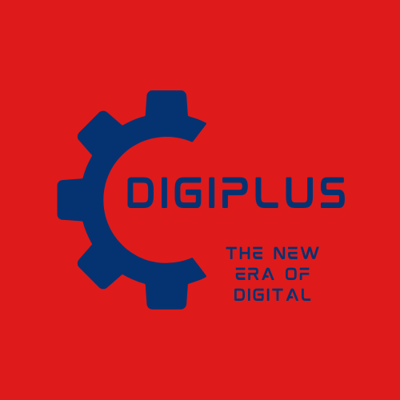

# DIGIPLUS

 Hello Everyone, This is the readme for my construct week project made using various advanced tech stack and has been successfully completed within the span of 5 days.

<h3><b>OBJECTIVE<b/></h3>

 Digiplus is a clone of the famous digital online retail store known as RELIANCE DIGITAL. It primarily is involved in selling a range of digital products and latest appliances. 

It is an individual project executed in a span of 5 days.

 The website consist of pages like landing page, register and login page for authentication purposes of both the user side and the admin side, 3 different categories of products page, product detail page, cart section, the payment section , the checkout page made with acordian consisting of checkout, summary, and details, an otp page for final approval. This website also has an admin panel to add, delete, update any products and also have logs of the users who are registering into the website. 

<h3>TECH-STACK -   HTML | CSS | Javascript | REACT | CHAKRA-UI</h3>

PROJECT LOGO-
 

LANDING PAGE-
 

 

REGISTER PAGE-
 

 

LOGIN PAGE-
 

 

PRODUCT PAGES-
  
1) MOBILES SECTION
 
  
2) LAPTOPS SECTION
 
  
3) HEADPHONES SECTION
 
 

 
 
SINGLE PRODUCT PAGE-

 
 
CART SECTION-
 

 
 
CHECKOUT SECTION-
 

 
 
OTP MODAL-
 

 
 
ADMIN PANEL-
 

